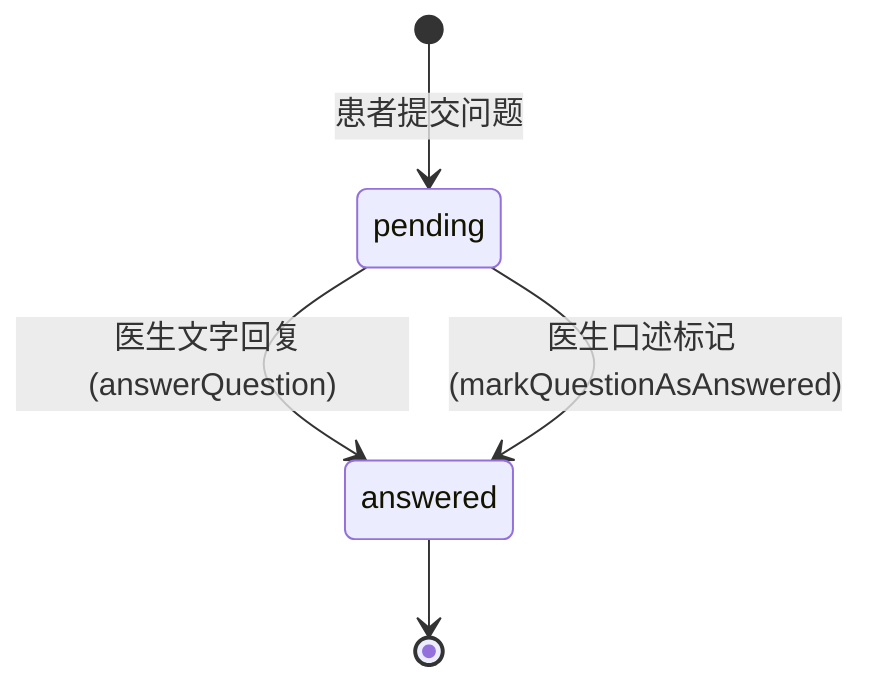

# API 接口文档

## 概述

本项目为纯前端 Vue 3 SPA 应用，**当前没有独立的后端 API 服务**。所有数据操作均通过客户端 Store（`src/store/index.ts`）在内存中完成，数据源为静态 JSON 文件。

本文档定义了：
1. **Store 方法 API** — 当前前端内存中的数据操作接口
2. **推荐的后端 RESTful API** — 未来后端化时应实现的 API 设计

---

## 一、Store 方法 API（当前实现）

当前所有业务逻辑通过 `src/store/index.ts` 中的 `store` 对象提供。Store 使用 Vue 3 `reactive` 管理状态，数据在页面刷新后丢失。

### Store 状态

```typescript
interface State {
  doctors: Doctor[];         // 医生列表
  patients: Patient[];       // 患者列表
  questions: Question[];     // 问题列表
  currentDoctor: Doctor | null;   // 当前登录医生
  currentPatient: Patient | null; // 当前登录患者
}
```

### 方法列表

| 方法 | 签名 | 说明 | 返回值 |
|------|------|------|--------|
| `loginDoctor` | `(username: string, password: string) => Doctor \| null` | 医生登录验证 | 匹配的 Doctor 或 null |
| `logoutDoctor` | `() => void` | 医生退出登录 | void |
| `verifyPatient` | `(name: string, birthday: string) => Patient` | 患者身份验证（不存在则自动创建） | Patient |
| `logoutPatient` | `() => void` | 患者退出登录 | void |
| `getQuestionsByDoctor` | `(doctorId: string) => Question[]` | 获取指定医生的所有问题 | Question[] |
| `getQuestionsByPatient` | `(patientId: string) => Question[]` | 获取指定患者的所有问题 | Question[] |
| `addQuestion` | `(question: Omit<Question, 'id' \| 'submitTime' \| 'status' \| 'answer' \| 'answerTime'>) => Question` | 患者提交新问题 | 新创建的 Question |
| `answerQuestion` | `(questionId: string, answer: string) => void` | 医生文字回复问题 | void |
| `markQuestionAsAnswered` | `(questionId: string) => void` | 标记问题为口述已解答 | void |
| `getDoctorByUsername` | `(username: string) => Doctor \| undefined` | 按用户名查找医生 | Doctor 或 undefined |
| `getActiveDoctors` | `() => Doctor[]` | 获取所有在线医生 | Doctor[] |
| `getStatistics` | `() => { totalDoctors, totalQuestions, activeSessions, totalSessions }` | 获取首页统计数据 | 统计对象 |

---

## 二、推荐的后端 RESTful API 设计

以下为项目后端化时应实现的 API 接口设计，基于当前前端功能推导。

### API 元数据

| 项目 | 值 |
|------|------|
| **基础 URL（开发）** | `http://localhost:8080/api/v1` |
| **基础 URL（生产）** | `https://api.healthcare-demo.com/api/v1` |
| **版本策略** | URL 路径版本 `/api/v1/` |
| **认证方式** | JWT Bearer Token |
| **内容类型** | `application/json` |

### 通用请求头

| Header | 必需 | 说明 | 示例 |
|--------|------|------|------|
| `Content-Type` | 是 | 请求内容类型 | `application/json` |
| `Accept` | 是 | 期望响应类型 | `application/json` |
| `Authorization` | 条件 | JWT 认证令牌 | `Bearer eyJhbGciOiJIUzI1NiIs...` |

### 通用错误响应格式

```json
{
  "error": {
    "code": "ERROR_CODE",
    "message": "可读的错误描述",
    "details": {}
  },
  "timestamp": "2025-11-02T10:30:00Z",
  "requestId": "req_abc123"
}
```

### 错误码参考

| 错误码 | HTTP 状态 | 说明 |
|--------|----------|------|
| `VALIDATION_ERROR` | 400 | 请求参数验证失败 |
| `UNAUTHORIZED` | 401 | 未认证或令牌过期 |
| `FORBIDDEN` | 403 | 权限不足 |
| `NOT_FOUND` | 404 | 资源不存在 |
| `CONFLICT` | 409 | 资源冲突（如用户名已存在） |
| `INTERNAL_ERROR` | 500 | 服务器内部错误 |

---

### 2.1 认证模块 — AuthController

**源码参考**: `src/views/DoctorLogin.vue`, `src/store/index.ts` → `loginDoctor`, `verifyPatient`

| 端点 | 方法 | 说明 | 认证 | 状态码 |
|------|------|------|------|--------|
| `/auth/doctor/login` | POST | 医生登录 | 公开 | 200, 400, 401 |
| `/auth/doctor/logout` | POST | 医生退出 | JWT | 200, 401 |
| `/auth/patient/verify` | POST | 患者身份验证/注册 | 公开 | 200, 201, 400 |
| `/auth/patient/logout` | POST | 患者退出 | JWT | 200, 401 |

#### POST /auth/doctor/login

**说明**: 医生使用用户名和密码登录系统。

**请求参数**:

| 参数 | 类型 | 必需 | 说明 | 示例 |
|------|------|------|------|------|
| `username` | string | 是 | 医生用户名 | `"dr-zhang-wei"` |
| `password` | string | 是 | 登录密码 | `"123456"` |

**成功响应 (200)**:

```json
{
  "token": "eyJhbGciOiJIUzI1NiIsInR5cCI6IkpXVCJ9...",
  "doctor": {
    "id": "doc001",
    "username": "dr-zhang-wei",
    "name": "张伟医生",
    "title": "主任医师",
    "department": "心内科",
    "avatar": "https://images.pexels.com/...",
    "experience": "15年临床经验",
    "specialties": ["高血压", "冠心病", "心律失常"],
    "isActive": true
  },
  "expiresIn": 3600
}
```

**错误响应**:
- **400** — 请求格式无效
- **401** — 用户名或密码错误

---

#### POST /auth/patient/verify

**说明**: 患者通过姓名和生日验证身份。若不存在则自动创建新患者账户。

**请求参数**:

| 参数 | 类型 | 必需 | 说明 | 示例 |
|------|------|------|------|------|
| `name` | string | 是 | 患者姓名 | `"赵明"` |
| `birthday` | string | 是 | 出生日期 (YYYY-MM-DD) | `"1985-03-15"` |

**成功响应 — 已存在 (200)**:

```json
{
  "token": "eyJhbGciOiJIUzI1NiIsInR5cCI6IkpXVCJ9...",
  "patient": {
    "id": "patient001",
    "name": "赵明",
    "birthday": "1985-03-15",
    "phone": "138****1234",
    "gender": "男"
  },
  "isNew": false,
  "expiresIn": 3600
}
```

**成功响应 — 新创建 (201)**:

```json
{
  "token": "eyJhbGciOiJIUzI1NiIsInR5cCI6IkpXVCJ9...",
  "patient": {
    "id": "patient1709312400000",
    "name": "新患者",
    "birthday": "1990-01-01",
    "phone": "",
    "gender": ""
  },
  "isNew": true,
  "expiresIn": 3600
}
```

**错误响应**:
- **400** — 请求参数验证失败

---

### 2.2 医生模块 — DoctorController

**源码参考**: `src/store/index.ts` → `getActiveDoctors`, `getDoctorByUsername`; `src/views/Doctors.vue`, `src/views/Home.vue`

| 端点 | 方法 | 说明 | 认证 | 状态码 |
|------|------|------|------|--------|
| `/doctors` | GET | 获取所有医生列表 | 公开 | 200 |
| `/doctors/active` | GET | 获取在线医生列表 | 公开 | 200 |
| `/doctors/{id}` | GET | 获取指定医生详情 | 公开 | 200, 404 |
| `/doctors/username/{username}` | GET | 按用户名查找医生 | 公开 | 200, 404 |

#### GET /doctors

**说明**: 获取所有医生列表，包含在线和离线状态。

**请求参数**: 无

**成功响应 (200)**:

```json
[
  {
    "id": "doc001",
    "username": "dr-zhang-wei",
    "name": "张伟医生",
    "title": "主任医师",
    "department": "心内科",
    "avatar": "https://images.pexels.com/...",
    "experience": "15年临床经验",
    "specialties": ["高血压", "冠心病", "心律失常"],
    "isActive": true
  },
  {
    "id": "doc004",
    "username": "dr-liu-min",
    "name": "刘敏医生",
    "title": "主任医师",
    "department": "妇产科",
    "avatar": "https://images.pexels.com/...",
    "experience": "18年临床经验",
    "specialties": ["孕期保健", "妇科炎症", "产后恢复"],
    "isActive": false
  }
]
```

---

#### GET /doctors/active

**说明**: 获取所有在线（`isActive: true`）的医生列表。

**请求参数**: 无

**成功响应 (200)**: 返回 `isActive` 为 `true` 的医生数组（格式同上，仅包含在线医生）。

---

#### GET /doctors/{id}

**说明**: 根据 ID 获取指定医生的详细信息。

**路径参数**:

| 参数 | 类型 | 说明 | 示例 |
|------|------|------|------|
| `id` | string | 医生唯一标识 | `doc001` |

**成功响应 (200)**: 单个 Doctor 对象。

**错误响应**:
- **404** — 医生不存在

---

#### GET /doctors/username/{username}

**说明**: 根据用户名查找医生，用于诊室路由 `/consultation/:doctorUsername`。

**路径参数**:

| 参数 | 类型 | 说明 | 示例 |
|------|------|------|------|
| `username` | string | 医生用户名 | `dr-zhang-wei` |

**成功响应 (200)**: 单个 Doctor 对象。

**错误响应**:
- **404** — 用户名不存在

---

### 2.3 患者模块 — PatientController

**源码参考**: `src/store/index.ts` → `verifyPatient`; `src/views/Consultation.vue`

| 端点 | 方法 | 说明 | 认证 | 状态码 |
|------|------|------|------|--------|
| `/patients/me` | GET | 获取当前登录患者信息 | JWT | 200, 401 |
| `/patients/me` | PUT | 更新患者资料（手机、性别） | JWT | 200, 400, 401 |

#### GET /patients/me

**说明**: 获取当前已认证患者的个人信息。

**请求参数**: 无（通过 JWT Token 识别）

**成功响应 (200)**:

```json
{
  "id": "patient001",
  "name": "赵明",
  "birthday": "1985-03-15",
  "phone": "138****1234",
  "gender": "男"
}
```

**错误响应**:
- **401** — 未认证或令牌过期

---

#### PUT /patients/me

**说明**: 更新当前患者的可选资料（手机号码和性别）。当前前端暂未实现此功能，但数据模型已预留字段。

**请求参数**:

| 参数 | 类型 | 必需 | 说明 | 示例 |
|------|------|------|------|------|
| `phone` | string | 否 | 手机号码 | `"13812341234"` |
| `gender` | string | 否 | 性别 | `"男"` |

**成功响应 (200)**: 更新后的 Patient 对象。

**错误响应**:
- **400** — 数据格式无效
- **401** — 未认证

---

### 2.4 问题模块 — QuestionController

**源码参考**: `src/store/index.ts` → `addQuestion`, `answerQuestion`, `markQuestionAsAnswered`, `getQuestionsByDoctor`, `getQuestionsByPatient`; `src/views/Consultation.vue`, `src/views/DoctorRoom.vue`

| 端点 | 方法 | 说明 | 认证 | 状态码 |
|------|------|------|------|--------|
| `/questions` | POST | 患者提交新问题 | JWT（患者） | 201, 400, 401 |
| `/questions/doctor/{doctorId}` | GET | 获取指定医生的所有问题 | JWT（医生） | 200, 401, 404 |
| `/questions/patient/{patientId}` | GET | 获取指定患者的所有问题 | JWT（患者） | 200, 401, 404 |
| `/questions/{id}/answer` | POST | 医生文字回复问题 | JWT（医生） | 200, 400, 401, 404 |
| `/questions/{id}/mark-answered` | POST | 医生标记问题为口述已解答 | JWT（医生） | 200, 401, 404 |

#### POST /questions

**说明**: 患者向指定医生提交新的问诊问题。

**请求参数**:

| 参数 | 类型 | 必需 | 说明 | 示例 |
|------|------|------|------|------|
| `patientId` | string | 是 | 患者ID（从Token提取） | `"patient001"` |
| `patientName` | string | 是 | 患者姓名 | `"赵明"` |
| `doctorId` | string | 是 | 目标医生ID | `"doc001"` |
| `doctorName` | string | 是 | 医生姓名 | `"张伟医生"` |
| `question` | string | 是 | 问题描述（不能为空） | `"最近总是感觉胸闷气短..."` |

**成功响应 (201)**:

```json
{
  "id": "q1709312400000",
  "patientId": "patient001",
  "patientName": "赵明",
  "doctorId": "doc001",
  "doctorName": "张伟医生",
  "question": "最近总是感觉胸闷气短...",
  "submitTime": "2025-11-02T14:20:00.000Z",
  "status": "pending",
  "answer": null,
  "answerTime": null
}
```

**错误响应**:
- **400** — 必填字段缺失或 `question` 为空
- **401** — 未认证

---

#### GET /questions/doctor/{doctorId}

**说明**: 获取指定医生收到的所有问题，按提交时间倒序排列。

**路径参数**:

| 参数 | 类型 | 说明 | 示例 |
|------|------|------|------|
| `doctorId` | string | 医生唯一标识 | `doc001` |

**查询参数**:

| 参数 | 类型 | 必需 | 说明 | 示例 |
|------|------|------|------|------|
| `status` | string | 否 | 按状态筛选 | `pending`, `answered` |

**成功响应 (200)**:

```json
[
  {
    "id": "q004",
    "patientId": "patient001",
    "patientName": "赵明",
    "doctorId": "doc001",
    "doctorName": "张伟医生",
    "question": "血压最近有点高...",
    "submitTime": "2025-11-02T14:20:00.000Z",
    "status": "pending",
    "answer": null,
    "answerTime": null
  }
]
```

---

#### GET /questions/patient/{patientId}

**说明**: 获取指定患者提交的所有问题。

**路径参数**:

| 参数 | 类型 | 说明 | 示例 |
|------|------|------|------|
| `patientId` | string | 患者唯一标识 | `patient001` |

**查询参数**: 同上（支持 `status` 筛选）

**成功响应 (200)**: Question 数组（格式同上）

---

#### POST /questions/{id}/answer

**说明**: 医生对问题进行文字回复，问题状态变为 `answered`。

**路径参数**:

| 参数 | 类型 | 说明 | 示例 |
|------|------|------|------|
| `id` | string | 问题唯一标识 | `q002` |

**请求参数**:

| 参数 | 类型 | 必需 | 说明 | 示例 |
|------|------|------|------|------|
| `answer` | string | 是 | 回复内容（不能为空） | `"根据您的描述,建议..."` |

**成功响应 (200)**:

```json
{
  "id": "q002",
  "patientId": "patient002",
  "patientName": "孙丽",
  "doctorId": "doc002",
  "doctorName": "李娜医生",
  "question": "孩子5岁,最近总是咳嗽...",
  "submitTime": "2025-11-02T10:15:00.000Z",
  "status": "answered",
  "answer": "根据您的描述,建议...",
  "answerTime": "2025-11-02T11:00:00.000Z"
}
```

**错误响应**:
- **400** — 回复内容为空
- **401** — 未认证或非医生角色
- **404** — 问题不存在

---

#### POST /questions/{id}/mark-answered

**说明**: 医生将问题标记为已通过口述方式解答（非文字回复），系统自动填充 `"已口述解答"`。

**路径参数**:

| 参数 | 类型 | 说明 | 示例 |
|------|------|------|------|
| `id` | string | 问题唯一标识 | `q002` |

**请求参数**: 无

**成功响应 (200)**:

```json
{
  "id": "q002",
  "status": "answered",
  "answer": "已口述解答",
  "answerTime": "2025-11-02T11:00:00.000Z"
}
```

**错误响应**:
- **401** — 未认证或非医生角色
- **404** — 问题不存在

---

### 2.5 统计模块 — StatisticsController

**源码参考**: `src/store/index.ts` → `getStatistics`; `src/views/Home.vue`

| 端点 | 方法 | 说明 | 认证 | 状态码 |
|------|------|------|------|--------|
| `/statistics` | GET | 获取首页统计数据 | 公开 | 200 |

#### GET /statistics

**说明**: 获取首页展示的统计数据，包括医生总数、问题总数、待响应问题数和在线诊室数。

**请求参数**: 无

**成功响应 (200)**:

```json
{
  "totalDoctors": 5,
  "totalQuestions": 7,
  "activeSessions": 4,
  "totalSessions": 4
}
```

| 字段 | 类型 | 说明 | 计算逻辑 |
|------|------|------|---------|
| `totalDoctors` | number | 医生总数 | `doctors.length` |
| `totalQuestions` | number | 问题总数 | `questions.length` |
| `activeSessions` | number | 待响应问题数 | `questions.filter(q => q.status === 'pending').length` |
| `totalSessions` | number | 在线诊室数 | `doctors.filter(d => d.isActive).length` |

---

## 三、路由 API（前端路由表）

当前前端路由定义在 `src/router/index.ts`，使用 `createWebHistory` 模式：

| 路径 | 名称 | 组件 | 说明 |
|------|------|------|------|
| `/` | Home | `Home.vue` | 首页 — 平台介绍、统计、开放诊室 |
| `/consultation` | Consultation | `Consultation.vue` | 问诊入口 — 患者身份验证 |
| `/consultation/:doctorUsername` | ConsultationRoom | `Consultation.vue` | 指定医生的问诊室 |
| `/doctors` | Doctors | `Doctors.vue` | 医生团队列表 |
| `/about` | About | `About.vue` | 关于页面 |
| `/doctor/login` | DoctorLogin | `DoctorLogin.vue` | 医生登录页 |
| `/doctor/room/:username` | DoctorRoom | `DoctorRoom.vue` | 医生诊室管理页 |

### 路由参数说明

| 路由 | 参数 | 类型 | 说明 | 示例 |
|------|------|------|------|------|
| `ConsultationRoom` | `doctorUsername` | string | 医生用户名，用于定位医生 | `dr-zhang-wei` |
| `DoctorRoom` | `username` | string | 医生用户名，需登录后访问 | `dr-zhang-wei` |

### 路由守卫说明

- `DoctorRoom` 页面在 `onMounted` 中检查 `currentDoctor` 是否匹配路由参数 `username`，不匹配则重定向到 `/doctor/login`
- 其他页面无路由守卫保护

---

## 四、数据模型参考

### Doctor

```typescript
interface Doctor {
  id: string;           // 唯一标识，如 "doc001"
  username: string;     // 登录用户名，如 "dr-zhang-wei"
  password: string;     // 登录密码（明文，仅用于演示）
  name: string;         // 显示名称，如 "张伟医生"
  title: string;        // 职称，如 "主任医师"
  department: string;   // 科室，如 "心内科"
  avatar: string;       // 头像URL
  experience: string;   // 从业经验，如 "15年临床经验"
  specialties: string[];// 专长列表
  isActive: boolean;    // 是否在线
}
```

### Patient

```typescript
interface Patient {
  id: string;           // 唯一标识，如 "patient001" 或自动生成 "patient{timestamp}"
  name: string;         // 姓名
  birthday: string;     // 出生日期 "YYYY-MM-DD"
  phone: string;        // 手机号（脱敏显示）
  gender: string;       // 性别
}
```

### Question

```typescript
interface Question {
  id: string;                           // 唯一标识，如 "q001" 或自动生成 "q{timestamp}"
  patientId: string;                    // 患者ID
  patientName: string;                  // 患者姓名（冗余存储）
  doctorId: string;                     // 医生ID
  doctorName: string;                   // 医生姓名（冗余存储）
  question: string;                     // 问题描述
  submitTime: string;                   // 提交时间 ISO 8601
  status: 'pending' | 'answered';       // 问题状态
  answer: string | null;                // 回复内容
  answerTime: string | null;            // 回复时间 ISO 8601
}
```

---

## 五、问题状态流转



| 状态 | 说明 | 触发操作 |
|------|------|---------|
| `pending` | 待解答 | `addQuestion()` 创建时自动设置 |
| `answered` | 已解答 | `answerQuestion()` 或 `markQuestionAsAnswered()` |

---

## 六、API 测试命令

以下 cURL 命令基于推荐的后端 API 设计，需后端实现后方可使用：

```bash
# 医生登录
curl -X POST http://localhost:8080/api/v1/auth/doctor/login \
  -H "Content-Type: application/json" \
  -d '{"username":"dr-zhang-wei","password":"123456"}'

# 患者验证
curl -X POST http://localhost:8080/api/v1/auth/patient/verify \
  -H "Content-Type: application/json" \
  -d '{"name":"赵明","birthday":"1985-03-15"}'

# 获取在线医生列表
curl -X GET http://localhost:8080/api/v1/doctors/active

# 提交问题（需患者Token）
TOKEN="your-patient-jwt-token"
curl -X POST http://localhost:8080/api/v1/questions \
  -H "Content-Type: application/json" \
  -H "Authorization: Bearer $TOKEN" \
  -d '{"patientId":"patient001","patientName":"赵明","doctorId":"doc001","doctorName":"张伟医生","question":"最近总是感觉胸闷气短"}'

# 医生回复问题（需医生Token）
DOCTOR_TOKEN="your-doctor-jwt-token"
curl -X POST http://localhost:8080/api/v1/questions/q002/answer \
  -H "Content-Type: application/json" \
  -H "Authorization: Bearer $DOCTOR_TOKEN" \
  -d '{"answer":"根据您的描述,建议您做个检查"}'

# 标记口述已解答
curl -X POST http://localhost:8080/api/v1/questions/q002/mark-answered \
  -H "Authorization: Bearer $DOCTOR_TOKEN"

# 获取统计数据
curl -X GET http://localhost:8080/api/v1/statistics
```

---

## 七、前端 Store 调用映射

| 页面 | Store 调用 | 用途 |
|------|-----------|------|
| `Home.vue` | `store.getStatistics()` | 首页统计卡片 |
| `Home.vue` | `store.getActiveDoctors()` | 开放诊室列表 |
| `Doctors.vue` | `store.state.doctors` | 医生团队列表 |
| `Consultation.vue` | `store.verifyPatient()` | 患者身份验证 |
| `Consultation.vue` | `store.logoutPatient()` | 切换患者 |
| `Consultation.vue` | `store.getQuestionsByPatient()` | 我的问题列表 |
| `Consultation.vue` | `store.addQuestion()` | 提交新问题 |
| `Consultation.vue` | `store.getActiveDoctors()` | 选择医生下拉列表 |
| `Consultation.vue` | `store.getDoctorByUsername()` | 路由参数匹配医生 |
| `DoctorLogin.vue` | `store.loginDoctor()` | 医生登录 |
| `DoctorRoom.vue` | `store.getQuestionsByDoctor()` | 获取医生问题列表 |
| `DoctorRoom.vue` | `store.answerQuestion()` | 文字回复 |
| `DoctorRoom.vue` | `store.markQuestionAsAnswered()` | 标记口述已解答 |
| `DoctorRoom.vue` | `store.logoutDoctor()` | 退出登录 |

---

## 八、API 变更日志

| 版本 | 日期 | 变更 |
|------|------|------|
| **v1.0.0** | 2025-11-02 | 初始 API 文档，基于前端 Store 方法推导后端 API 设计 |

---

*本文档同时记录了当前前端 Store 方法和推荐的后端 RESTful API 设计。当后端 API 实现后，应替换前端 Store 中的内存操作为 HTTP 请求调用。使用 `/asdm-context-update` 命令可在 API 变更时更新此文档。*
