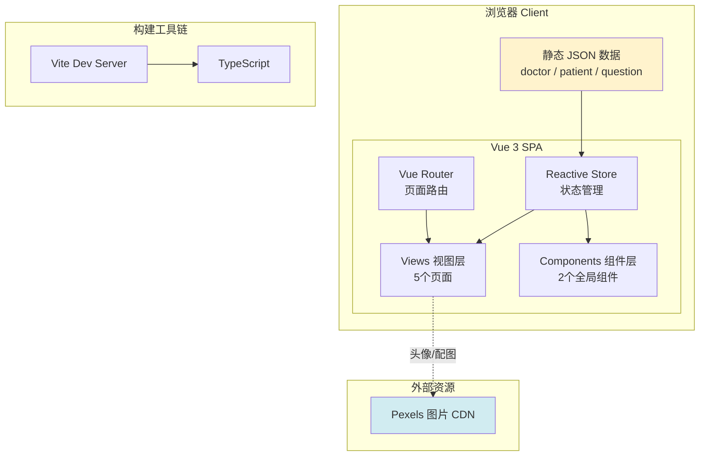
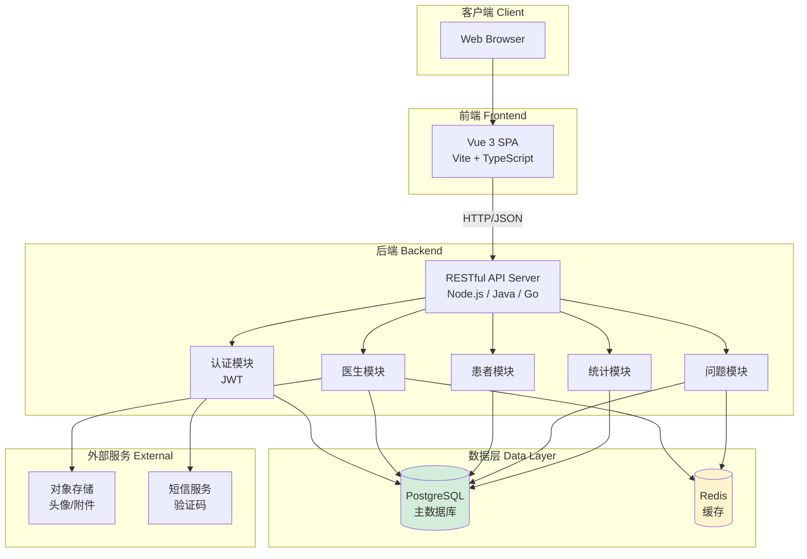
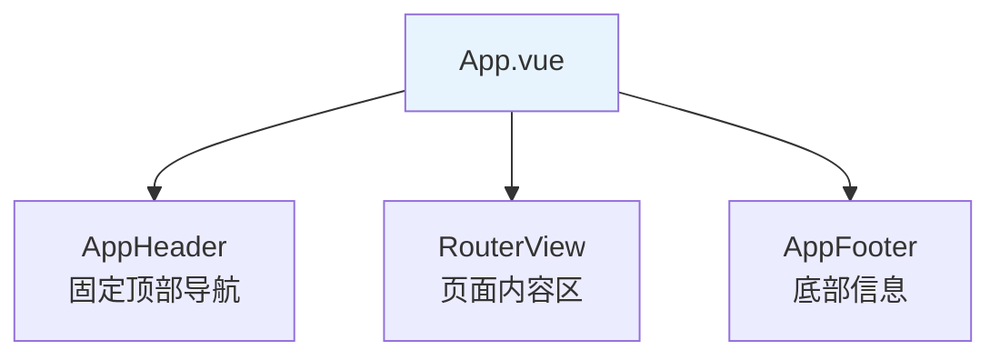
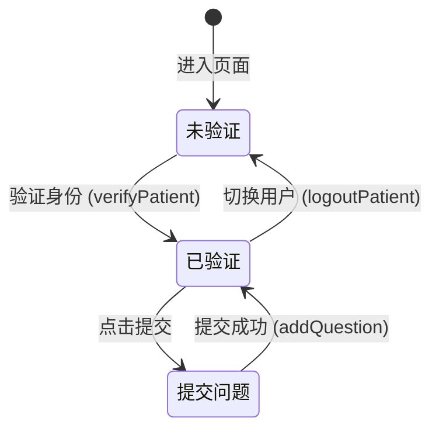
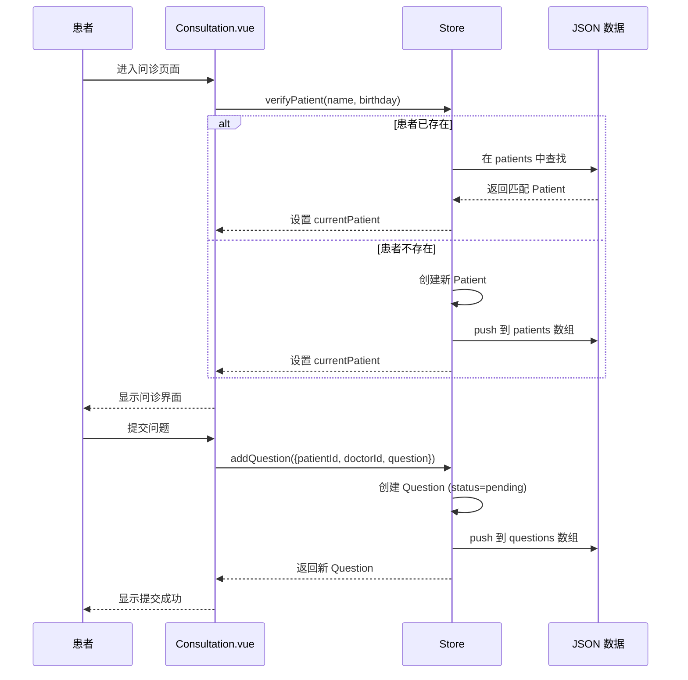
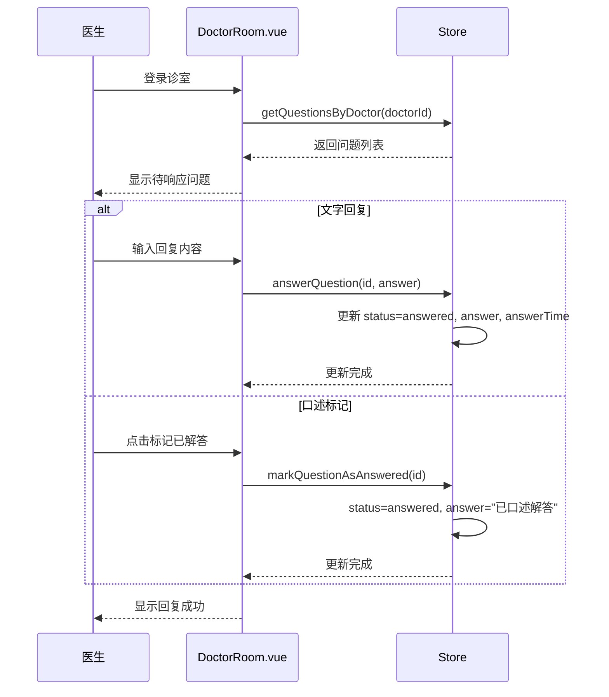
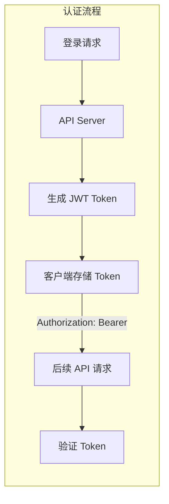
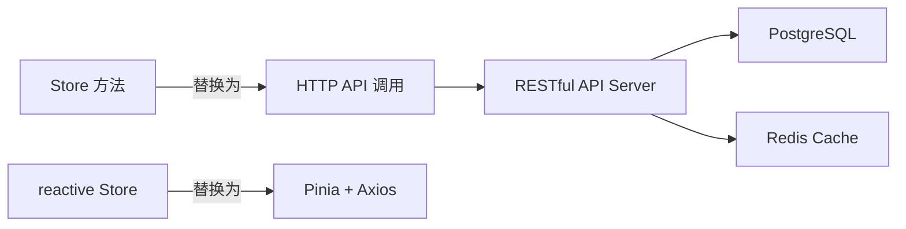

# 系统架构文档

## 概述

本文档描述 QA Live Healthcare 在线医疗问诊平台的系统架构、设计决策和技术模式。为 AI 模型提供对系统结构和设计原则的全面理解。

---

## 一、架构总览

### 当前架构：纯前端单体 SPA

本项目当前为**纯前端单体应用**，无后端服务。所有数据存储在客户端内存中，使用静态 JSON 文件作为数据源。



### 目标架构：前后端分离



---

## 二、架构原则

### 1. 关注点分离
- **视图层（Views）**：负责 UI 渲染和用户交互
- **组件层（Components）**：可复用的 UI 片段（Header / Footer）
- **状态管理层（Store）**：集中管理应用状态和业务逻辑
- **数据层（Data）**：静态 JSON 数据源
- **路由层（Router）**：页面导航和参数传递

### 2. 单向数据流
```
JSON 数据 → Store（reactive） → View（computed 渲染） → 用户操作 → Store 方法 → 状态更新 → 视图响应
```

### 3. 组件化设计
- 全局组件：`AppHeader`、`AppFooter` 在 `App.vue` 中布局
- 页面组件：每个路由对应一个独立 Vue 文件
- 所有组件使用 `<script setup lang="ts">` 组合式 API

### 4. 最小化依赖
- UI 框架：Ant Design Vue（全量引入）
- 路由：Vue Router 4
- 日期：dayjs
- 图标：@ant-design/icons-vue
- 无 Pinia / Vuex，使用原生 `reactive` 做状态管理

---

## 三、组件详情

### 应用入口 — main.ts

**职责**：创建 Vue 应用实例，注册全局插件

```typescript
// 初始化流程
createApp(App)     // 1. 创建应用
  .use(Antd)       // 2. 注册 Ant Design Vue（全量引入）
  .use(router)     // 3. 注册路由
  .mount('#app')   // 4. 挂载到 DOM
```

**源码**: `src/main.ts`

### 根组件 — App.vue

**职责**：定义全局布局（Header + Content + Footer）



**源码**: `src/App.vue`

### 状态管理 — Store

**职责**：集中管理所有业务数据，提供 12 个操作方法

**技术选择**：Vue 3 `reactive` 而非 Pinia/Vuex

| 设计决策 | 原因 |
|---------|------|
| 使用 `reactive` 而非 Pinia | 项目规模小，无需额外依赖；原型演示阶段 |
| 数据从 JSON 静态导入 | 无后端，数据初始化简单直接 |
| 明文密码存储 | 仅用于演示，后端化时必须改为哈希 |
| 冗余字段（patientName/doctorName） | 避免前端多次联表查询，简化展示逻辑 |

**源码**: `src/store/index.ts`

### 路由 — Router

**职责**：管理页面导航，使用 HTML5 History 模式

| 路由 | 守卫 | 说明 |
|------|------|------|
| `/` | 无 | 首页，公开访问 |
| `/consultation` | 无 | 患者验证入口 |
| `/consultation/:doctorUsername` | 无 | 指定医生诊室 |
| `/doctors` | 无 | 医生列表，公开访问 |
| `/about` | 无 | 关于页面 |
| `/doctor/login` | 无 | 医生登录 |
| `/doctor/room/:username` | **组件内守卫** | 医生诊室管理 |

> **注意**：路由守卫在 `DoctorRoom.vue` 的 `onMounted` 中实现，非全局守卫。后端化时应改为全局路由守卫 + JWT 验证。

**源码**: `src/router/index.ts`

---

## 四、页面组件详情

### Home.vue — 首页

**功能**：平台介绍、统计数据、开放诊室

| 区域 | 数据来源 | Store 调用 |
|------|---------|-----------|
| 统计卡片 | `store.getStatistics()` | totalDoctors, totalQuestions, activeSessions, totalSessions |
| 开放诊室 | `store.getActiveDoctors()` | 过滤 `isActive === true` |

**交互**：
- "立即问诊" → `/consultation`
- "查看医生" → `/doctors`
- 诊室卡片 → `/consultation/{doctorUsername}`

### Consultation.vue — 患者问诊

**功能**：患者身份验证、提交问题、查看问题列表



**两种进入模式**：
1. 通用入口 `/consultation` — 需手动选择医生
2. 医生专属 `/consultation/:doctorUsername` — 自动选中该医生

### DoctorLogin.vue — 医生登录

**功能**：用户名 + 密码登录

**验证逻辑**：`store.loginDoctor(username, password)` 在 `doctors` 数组中精确匹配

### DoctorRoom.vue — 医生诊室

**功能**：查看待响应问题、文字回复、标记口述已解答

**关键交互**：
- 复制诊室链接：`navigator.clipboard.writeText()`
- 文字回复：`store.answerQuestion()`
- 标记已解答：`store.markQuestionAsAnswered()` — 自动填充 "已口述解答"

### Doctors.vue — 医生团队

**功能**：展示所有医生（在线/离线），在线医生可进入诊室

### About.vue — 关于页面

---

## 五、数据流详解

### 患者问诊流程



### 医生回复流程



---

## 六、设计模式

### 1. Reactive Store 模式（当前）

使用 Vue 3 的 `reactive` 实现轻量级状态管理：

```typescript
// 状态定义
const state = reactive<State>({
  doctors: doctorData as Doctor[],
  patients: patientData as Patient[],
  questions: questionData as Question[],
  currentDoctor: null,
  currentPatient: null,
});

// 方法以对象形式导出
export const store = {
  state,
  loginDoctor(username: string, password: string): Doctor | null { ... },
  logoutDoctor() { ... },
  // ...
};
```

**优点**：零依赖、简单直接、TypeScript 友好
**缺点**：无 DevTools 支持、无持久化、无模块化、无中间件

### 2. Computed 派生模式

视图层通过 `computed` 从 Store 派生数据，保持模板简洁：

```typescript
// 视图层常见模式
const currentPatient = computed(() => store.state.currentPatient);
const myQuestions = computed(() =>
  currentPatient.value
    ? store.getQuestionsByPatient(currentPatient.value.id)
    : []
);
```

### 3. 自动 ID 生成模式

新增实体使用 `Date.now()` 生成唯一 ID：

```typescript
id: `patient${Date.now()}`  // 患者
id: `q${Date.now()}`         // 问题
```

> **风险**：高并发下可能冲突。后端化时应使用 UUID 或数据库自增 ID。

### 4. 组件内守卫模式

非全局路由守卫，在组件 `onMounted` 中检查：

```typescript
onMounted(() => {
  if (!currentDoctor.value || currentDoctor.value.username !== username) {
    message.error('请先登录');
    router.push('/doctor/login');
  }
});
```

---

## 七、安全架构

### 当前状态（仅演示）

| 方面 | 现状 | 风险等级 |
|------|------|---------|
| 认证 | 内存中明文密码比对 | 🔴 高 |
| 授权 | 无角色校验，仅组件内检查 | 🔴 高 |
| 数据存储 | 客户端内存，刷新即丢失 | 🟡 中 |
| XSS | Vue 模板自动转义 | 🟢 低 |
| HTTPS | 开发环境未强制 | 🟡 中 |
| CSRF | SPA 无表单提交 | 🟢 低 |

### 后端化安全建议



| 方面 | 建议 |
|------|------|
| **认证** | JWT + bcrypt 密码哈希 |
| **授权** | 基于角色的访问控制（doctor / patient） |
| **传输** | 强制 HTTPS |
| **密码** | bcrypt/argon2 哈希存储，永不明文 |
| **Token** | 短期 JWT + Refresh Token 机制 |
| **验证码** | 登录失败次数限制 + 图形验证码 |

---

## 八、性能考量

### 当前性能特征

| 方面 | 现状 | 说明 |
|------|------|------|
| **首屏加载** | Ant Design Vue 全量引入 | 包体积较大，后续应改为按需引入 |
| **图片加载** | Pexels 外部 CDN | 依赖外部服务，可能有延迟 |
| **数据查询** | 内存 Array.filter | 数据量小时性能良好 |
| **响应式** | Vue 3 reactive | 细粒度响应式更新 |

### 优化建议

1. **Ant Design Vue 按需引入**：使用 `unplugin-vue-components` 自动按需加载
2. **图片优化**：使用本地占位图或 CDN + lazy loading
3. **路由懒加载**：将路由组件改为 `() => import()` 动态导入
4. **虚拟列表**：当问题数量增大时，使用虚拟滚动

---

## 九、技术栈详情

| 分类 | 技术 | 版本 | 说明 |
|------|------|------|------|
| **框架** | Vue 3 | ^3.5 | 组合式 API + `<script setup>` |
| **构建** | Vite | ^6.0 | 开发服务器 + 生产构建 |
| **语言** | TypeScript | ~5.6 | 类型安全 |
| **UI 库** | Ant Design Vue | ^4.2 | 企业级 UI 组件 |
| **图标** | @ant-design/icons-vue | ^7.0 | Ant Design 图标库 |
| **路由** | Vue Router | ^4.4 | HTML5 History 模式 |
| **日期** | dayjs | ^1.11 | 轻量日期格式化 |
| **状态管理** | Vue 3 reactive | 内置 | 无额外依赖 |

---

## 十、目录架构映射

```
src/
├── main.ts                 # 应用入口 — 创建 Vue 实例，注册插件
├── App.vue                 # 根组件 — 全局布局（Header + RouterView + Footer）
├── style.css               # 全局样式
├── router/
│   └── index.ts            # 路由配置 — 7 条路由，HTML5 History
├── store/
│   └── index.ts            # 状态管理 — reactive Store + 12 个方法
├── views/
│   ├── Home.vue            # 首页 — 统计 + 开放诊室
│   ├── Consultation.vue    # 问诊 — 患者验证 + 提交/查看问题
│   ├── Doctors.vue         # 医生团队 — 全部医生列表
│   ├── DoctorLogin.vue     # 医生登录 — 用户名 + 密码
│   ├── DoctorRoom.vue      # 医生诊室 — 回复问题 + 管理诊室
│   └── About.vue           # 关于页面
├── components/
│   ├── AppHeader.vue       # 顶部导航 — Logo + 菜单 + 登录按钮
│   └── AppFooter.vue       # 底部信息 — 链接 + 联系方式
├── data/
│   ├── doctor-user-list.json  # 医生数据（5条）
│   ├── patient-user.json      # 患者数据（5条）
│   └── question-list.json     # 问题数据（7条）
└── assets/                    # 静态资源（当前仅 SVG logo）
```

---

## 十一、架构演进路线

### Phase 1：当前 — 纯前端原型（已完成）

- ✅ Vue 3 SPA + Vite + TypeScript
- ✅ 内存状态管理
- ✅ 静态 JSON 数据
- ✅ 基本页面交互

### Phase 2：后端化



| 改动项 | 当前 | 目标 |
|--------|------|------|
| 状态管理 | `reactive` | Pinia + Axios |
| 认证 | 内存比对 | JWT Token |
| 数据持久化 | 内存 JSON | PostgreSQL |
| 密码存储 | 明文 | bcrypt 哈希 |
| 路由守卫 | 组件内 `onMounted` | 全局 `beforeEach` + Token 校验 |
| 图片存储 | Pexels 外链 | OSS 对象存储 |

### Phase 3：增强功能

| 功能 | 说明 |
|------|------|
| 实时通信 | WebSocket / Socket.io 实现消息推送 |
| 文件上传 | 支持检查报告、影像资料上传 |
| 通知系统 | 站内信 + 邮件/短信通知 |
| 预约系统 | 在线预约挂号 |
| 支付集成 | 问诊费用在线支付 |
| 管理后台 | 医生管理、数据统计后台 |

---

## 十二、关键架构决策记录

| 决策 | 选择 | 原因 | 替代方案 | 重新评估条件 |
|------|------|------|---------|------------|
| 状态管理 | Vue 3 `reactive` | 项目小、零依赖、够用 | Pinia | 超过 3 个 store 模块或需要 DevTools |
| UI 框架 | Ant Design Vue 全量引入 | 快速原型开发 | 按需引入 / Element Plus | 生产部署时需优化包体积 |
| 数据源 | 静态 JSON 导入 | 无需后端、开发简单 | LocalStorage / IndexedDB | 需要数据持久化时 |
| 路由模式 | HTML5 History | URL 美观 | Hash 模式 | 部署环境不支持 history fallback |
| 日期库 | dayjs | 轻量（2KB） | moment.js（过大） | 需要 moment 特有功能时 |
| ID 生成 | `Date.now()` 前缀 | 简单唯一 | UUID | 后端化时替换 |

---

*本文档描述了当前系统架构和演进方向。使用 `/asdm-context-update` 命令可在架构变更时更新此文档。*
