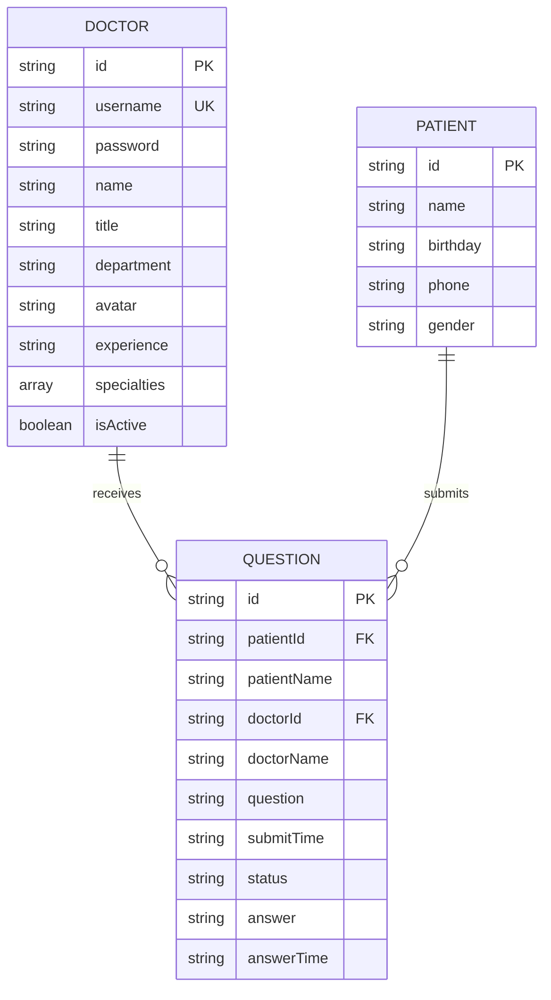
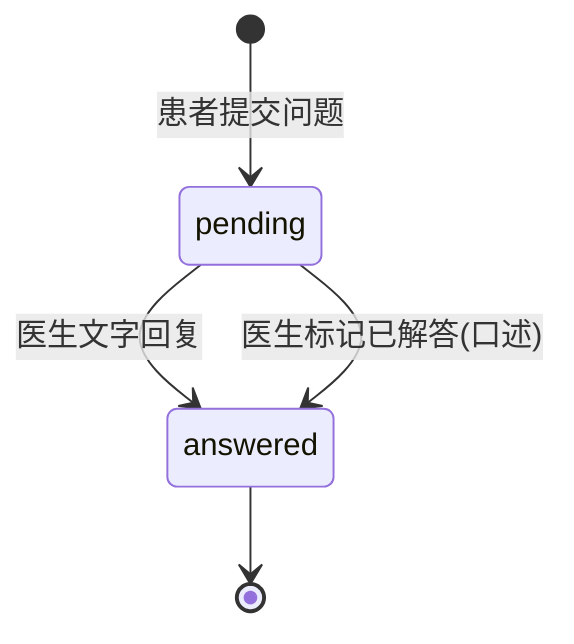
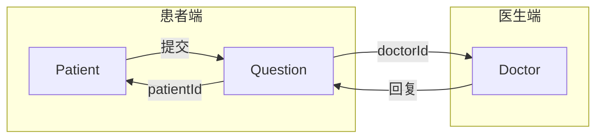

# 数据模型

## 概述
本文档描述了 QA Live Healthcare 工作区的数据模型、实体关系和数据流转。本项目为纯前端应用，不使用后端数据库，所有数据存储在内存中（基于 Vue `reactive`），初始数据从 JSON 文件加载。

## 实体关系图



## 实体定义

### Doctor（医生）

**用途**: 表示系统中的医生用户，包含认证信息和专业信息。

**源码位置**: [`src/store/index.ts`](../../src/store/index.ts)

```typescript
interface Doctor {
  id: string;           // 唯一标识，如 "doc001"
  username: string;     // 登录用户名，如 "dr-zhang-wei"
  password: string;     // 登录密码（明文，仅演示用）
  name: string;         // 显示名称，如 "张伟医生"
  title: string;        // 职称，如 "主任医师"
  department: string;   // 科室，如 "心内科"
  avatar: string;       // 头像 URL（外部图片）
  experience: string;   // 经验描述，如 "15年临床经验"
  specialties: string[];// 专长列表，如 ["高血压", "冠心病"]
  isActive: boolean;    // 是否在线接诊
}
```

**数据来源**: [`src/data/doctor-user-list.json`](../../src/data/doctor-user-list.json)

**示例数据**:
```json
{
  "id": "doc001",
  "username": "dr-zhang-wei",
  "password": "123456",
  "name": "张伟医生",
  "title": "主任医师",
  "department": "心内科",
  "avatar": "https://images.pexels.com/photos/5215024/...",
  "experience": "15年临床经验",
  "specialties": ["高血压", "冠心病", "心律失常"],
  "isActive": true
}
```

**预置数据**: 5 名医生（4 名在线，1 名离线）

| ID | 姓名 | 科室 | 职称 | 在线 |
|----|------|------|------|------|
| doc001 | 张伟医生 | 心内科 | 主任医师 | ✅ |
| doc002 | 李娜医生 | 儿科 | 副主任医师 | ✅ |
| doc003 | 王强医生 | 骨科 | 主治医师 | ✅ |
| doc004 | 刘敏医生 | 妇产科 | 主任医师 | ❌ |
| doc005 | 陈杰医生 | 消化内科 | 副主任医师 | ✅ |

---

### Patient（患者）

**用途**: 表示系统中的患者用户，通过姓名+生日进行身份验证。

**源码位置**: [`src/store/index.ts`](../../src/store/index.ts)

```typescript
interface Patient {
  id: string;       // 唯一标识，如 "patient001"（预置）或 "patient{timestamp}"（动态创建）
  name: string;     // 患者姓名
  birthday: string; // 生日，格式 "YYYY-MM-DD"
  phone: string;    // 电话（预置数据有值，动态创建时为空字符串）
  gender: string;   // 性别（预置数据有值，动态创建时为空字符串）
}
```

**数据来源**: [`src/data/patient-user.json`](../../src/data/patient-user.json)

**示例数据**:
```json
{
  "id": "patient001",
  "name": "赵明",
  "birthday": "1985-03-15",
  "phone": "138****1234",
  "gender": "男"
}
```

**动态创建逻辑**: 当患者验证时，若姓名+生日组合不存在，系统自动创建新患者记录（`phone` 和 `gender` 为空字符串）。

**预置数据**: 5 名患者

| ID | 姓名 | 生日 | 性别 |
|----|------|------|------|
| patient001 | 赵明 | 1985-03-15 | 男 |
| patient002 | 孙丽 | 1990-07-22 | 女 |
| patient003 | 周杰 | 1978-11-08 | 男 |
| patient004 | 吴芳 | 1995-05-20 | 女 |
| patient005 | 郑浩 | 1988-09-12 | 男 |

---

### Question（问诊问题）

**用途**: 表示患者向医生提交的问诊问题，是医生和患者之间的核心交互实体。

**源码位置**: [`src/store/index.ts`](../../src/store/index.ts)

```typescript
interface Question {
  id: string;                  // 唯一标识，如 "q001"（预置）或 "q{timestamp}"（动态创建）
  patientId: string;           // 关联患者 ID (FK → Patient.id)
  patientName: string;         // 患者姓名（冗余存储）
  doctorId: string;            // 关联医生 ID (FK → Doctor.id)
  doctorName: string;          // 医生姓名（冗余存储）
  question: string;            // 问题描述
  submitTime: string;          // 提交时间，ISO 8601 格式
  status: 'pending' | 'answered'; // 问题状态
  answer: string | null;       // 医生回复内容
  answerTime: string | null;   // 回复时间，ISO 8601 格式
}
```

**数据来源**: [`src/data/question-list.json`](../../src/data/question-list.json)

**示例数据**:
```json
{
  "id": "q001",
  "patientId": "patient001",
  "patientName": "赵明",
  "doctorId": "doc001",
  "doctorName": "张伟医生",
  "question": "最近总是感觉胸闷气短,特别是爬楼梯的时候,这是什么原因?",
  "submitTime": "2025-11-02T09:30:00",
  "status": "answered",
  "answer": "根据您的描述,可能是心脏功能问题。建议您做个心电图和心脏彩超检查,同时注意休息,避免剧烈运动。",
  "answerTime": "2025-11-02T09:45:00"
}
```

**状态流转**:



**预置数据**: 7 条问题（3 条已解答，4 条待解答）

---

### State（全局状态）

**用途**: 应用的响应式状态容器，整合所有实体和当前会话信息。

**源码位置**: [`src/store/index.ts`](../../src/store/index.ts)

```typescript
interface State {
  doctors: Doctor[];           // 医生列表
  patients: Patient[];         // 患者列表
  questions: Question[];       // 问题列表
  currentDoctor: Doctor | null; // 当前登录的医生
  currentPatient: Patient | null; // 当前验证的患者
}
```

## 实体关系

### 一对多关系
1. **Doctor → Question**: 一名医生可接收多个问题（通过 `doctorId` 关联）
2. **Patient → Question**: 一名患者可提交多个问题（通过 `patientId` 关联）

### 冗余字段说明
`Question` 实体中冗余存储了 `patientName` 和 `doctorName`，这是为了在问题列表展示时避免频繁的关联查询，属于前端性能优化的反规范化设计。

### 关系图示



## 数据流转

### 问诊流程

```mermaid
sequenceDiagram
    participant 患者 as 患者
    patient 患者
    participant 前端 as 前端界面
    participant Store as 响应式Store
    participant 医生 as 医生

    患者->>前端: 输入姓名+生日验证身份
    前端->>Store: verifyPatient(name, birthday)
    Store-->>前端: 返回 Patient 对象
    前端-->>患者: 验证成功/创建账户

    患者->>前端: 选择医生+填写问题
    前端->>Store: addQuestion({patientId, doctorId, question})
    Store-->>Store: 生成 id, submitTime, status='pending'
    Store-->>前端: 返回新 Question

    医生->>前端: 登录诊室
    前端->>Store: loginDoctor(username, password)
    Store-->>前端: 返回 Doctor 对象

    医生->>前端: 查看待响应问题
    前端->>Store: getQuestionsByDoctor(doctorId).filter(pending)
    Store-->>前端: 返回待解答问题列表

    医生->>前端: 文字回复
    前端->>Store: answerQuestion(questionId, answer)
    Store-->>Store: 更新 status='answered', answer, answerTime
    Store-->>前端: 回复成功

    患者->>前端: 查看我的问题
    前端->>Store: getQuestionsByPatient(patientId)
    Store-->>前端: 返回问题列表（含回复）
```

## Store 方法参考

### 医生相关
| 方法 | 参数 | 返回值 | 说明 |
|------|------|--------|------|
| `loginDoctor` | username, password | Doctor \| null | 医生登录验证 |
| `logoutDoctor` | - | void | 医生登出 |
| `getDoctorByUsername` | username | Doctor \| undefined | 按用户名查找医生 |
| `getActiveDoctors` | - | Doctor[] | 获取所有在线医生 |

### 患者相关
| 方法 | 参数 | 返回值 | 说明 |
|------|------|--------|------|
| `verifyPatient` | name, birthday | Patient | 验证患者身份，不存在则自动创建 |
| `logoutPatient` | - | void | 患者登出 |

### 问题相关
| 方法 | 参数 | 返回值 | 说明 |
|------|------|--------|------|
| `getQuestionsByDoctor` | doctorId | Question[] | 获取某医生的所有问题 |
| `getQuestionsByPatient` | patientId | Question[] | 获取某患者的所有问题 |
| `addQuestion` | {patientId, patientName, doctorId, doctorName, question} | Question | 新增问题 |
| `answerQuestion` | questionId, answer | void | 文字回复问题 |
| `markQuestionAsAnswered` | questionId | void | 标记为已口述解答 |

### 统计相关
| 方法 | 参数 | 返回值 | 说明 |
|------|------|--------|------|
| `getStatistics` | - | {totalDoctors, totalQuestions, activeSessions, totalSessions} | 获取平台统计数据 |

## 数据验证规则

### 医生登录验证
```typescript
// 用户名和密码均不能为空
const rules = {
  username: [{ required: true, message: '请输入用户名' }],
  password: [{ required: true, message: '请输入密码' }],
};
```

### 患者身份验证
```typescript
// 姓名和生日均不能为空
const authRules = {
  name: [{ required: true, message: '请输入姓名' }],
  birthday: [{ required: true, message: '请选择生日' }],
};
```

### 问题提交验证
```typescript
// 必须选择医生且问题内容不为空
if (!questionForm.doctorId) { /* 错误：请选择医生 */ }
if (!questionForm.question.trim()) { /* 错误：请输入问题 */ }
```

## 数据持久化说明

> ⚠️ **重要**: 本项目所有数据存储在 Vue `reactive` 对象中，页面刷新后数据将丢失并恢复为 JSON 文件中的初始状态。这是一个演示项目，不具备数据持久化能力。

**数据初始化流程**:
1. 应用启动时，`store/index.ts` 从 JSON 文件加载数据
2. 所有 CRUD 操作仅修改内存中的响应式对象
3. 页面刷新后，所有运行时修改将丢失

---

*本数据模型文档由 Context Builder 工具集维护。当数据模型发生变更时，使用 `/asdm-context-update` 更新。*
