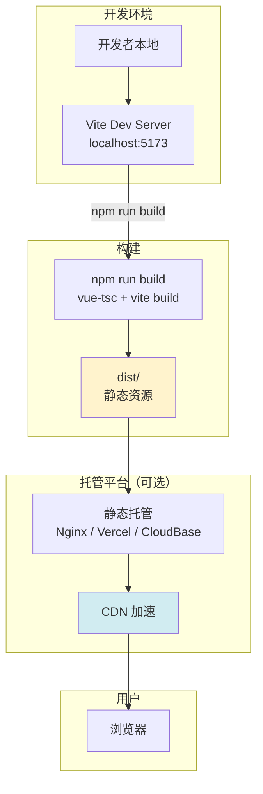
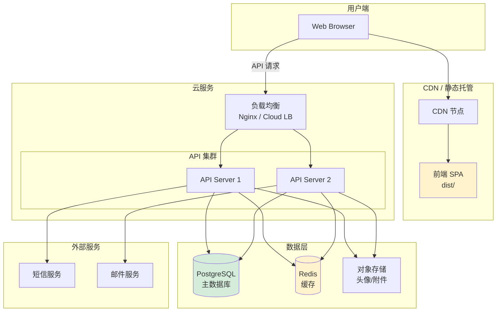
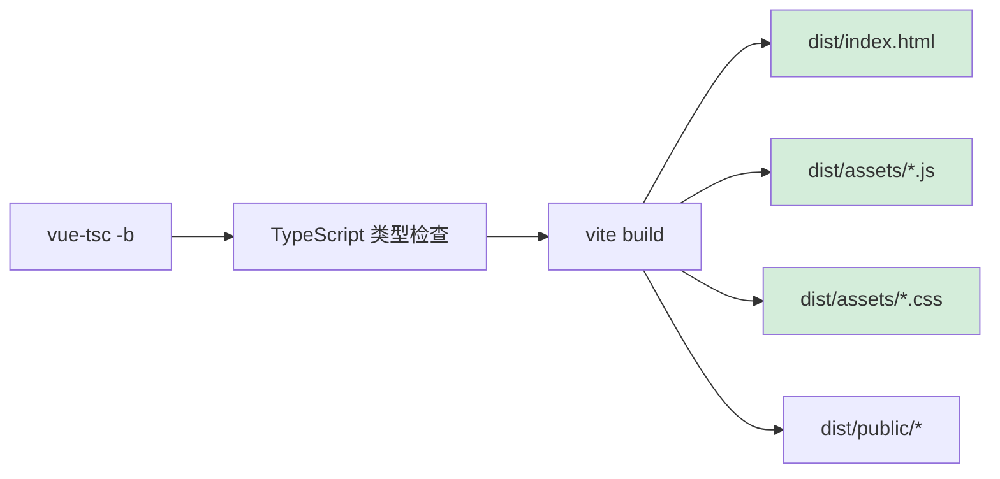
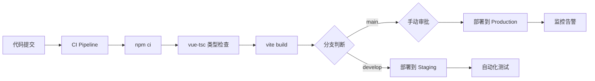

# 部署配置文档

## 概述

本文档描述 QA Live Healthcare 在线医疗问诊平台的部署架构、环境配置和部署流程。当前项目为纯前端 SPA，部署以静态资源托管为主。

---

## 一、部署架构

### 当前架构：静态站点托管

项目为纯前端 Vue 3 SPA，构建产物为静态 HTML/CSS/JS 文件，可部署到任何静态托管服务。



### 目标架构：前后端分离

后端化后的部署架构：



---

## 二、环境配置

### 开发环境

```yaml
# 开发环境配置
environment: development

# 前端
frontend:
  dev_server: http://localhost:5173
  hot_reload: true
  source_maps: true

# 构建工具
build:
  tool: Vite 5.4+
  typescript: 5.5+
  target: ES2020

# 数据源
data:
  type: static_json
  path: src/data/

# 无后端依赖
backend: none
```

**启动命令**：

```bash
# 安装依赖
npm install

# 启动开发服务器
npm run dev
# → Vite Dev Server 运行在 http://localhost:5173

# 类型检查
npx vue-tsc --noEmit
```

### 预发布环境

```yaml
# 预发布环境配置
environment: staging

frontend:
  base_url: https://staging.qalive.example.com
  api_base: https://staging-api.qalive.example.com/api/v1
  source_maps: true
  log_level: info

backend:
  api_url: https://staging-api.qalive.example.com
  cors_origins:
    - https://staging.qalive.example.com

database:
  host: ${DB_HOST}
  port: 5432
  name: qalive_staging
  username: ${DB_USERNAME}
  password: ${DB_PASSWORD}

cache:
  host: ${REDIS_HOST}
  port: 6379

storage:
  type: s3
  bucket: qalive-staging-assets
```

### 生产环境

```yaml
# 生产环境配置
environment: production

frontend:
  base_url: https://www.qalive.example.com
  api_base: https://api.qalive.example.com/api/v1
  source_maps: false
  log_level: warn
  gzip: true
  brotli: true

backend:
  api_url: https://api.qalive.example.com
  cors_origins:
    - https://www.qalive.example.com
  rate_limit:
    window_ms: 900000  # 15 分钟
    max_requests: 100

database:
  host: ${DB_HOST}
  port: 5432
  name: qalive_production
  username: ${DB_USERNAME}
  password: ${DB_PASSWORD}
  ssl: true
  pool:
    max: 20
    min: 5
    idle_timeout: 30000

cache:
  host: ${REDIS_HOST}
  port: 6379
  tls: true

storage:
  type: s3
  bucket: qalive-production-assets
  region: ap-east-1
  cdn_url: https://cdn.qalive.example.com
```

---

## 三、构建流程

### 构建命令

```bash
# 完整构建（类型检查 + 打包）
npm run build
# 等同于: vue-tsc -b && vite build
```

**构建步骤**：



### 构建产物

```
dist/
├── index.html              # 入口 HTML
├── assets/
│   ├── index-[hash].js     # 主 JS Bundle（含 Vue + 业务代码）
│   ├── index-[hash].css    # 主 CSS Bundle（含 Ant Design 样式）
│   └── vendor-[hash].js    # 第三方库（如果配置了分包）
└── public/
    └── vite.svg            # 静态资源
```

### 预览构建产物

```bash
# 本地预览生产构建
npm run preview
# → Vite Preview Server 运行在 http://localhost:4173
```

### Vite 构建配置

当前配置（`vite.config.ts`）为最简配置：

```typescript
export default defineConfig({
  plugins: [vue()],
})
```

**生产优化建议**：

```typescript
export default defineConfig({
  plugins: [vue()],
  build: {
    // 分包策略
    rollupOptions: {
      output: {
        manualChunks: {
          'vue-vendor': ['vue', 'vue-router'],
          'antd-vendor': ['ant-design-vue', '@ant-design/icons-vue'],
          'dayjs': ['dayjs'],
        }
      }
    },
    // 启用 gzip 压缩报告
    reportCompressedSize: true,
    // chunk 大小警告阈值
    chunkSizeWarningLimit: 1000,
  },
  // 生产环境 source map（按需开启）
  sourcemap: process.env.NODE_ENV !== 'production',
})
```

---

## 四、部署方式

### 方式一：Nginx 静态托管（推荐用于自有服务器）

#### Nginx 配置

```nginx
# /etc/nginx/conf.d/qalive.conf

server {
    listen 80;
    server_name www.qalive.example.com;
    return 301 https://$server_name$request_uri;
}

server {
    listen 443 ssl http2;
    server_name www.qalive.example.com;

    # SSL 证书
    ssl_certificate     /etc/nginx/ssl/qalive.crt;
    ssl_certificate_key /etc/nginx/ssl/qalive.key;

    # 前端静态资源
    root /var/www/qalive/dist;
    index index.html;

    # SPA History 模式 — 所有路由回退到 index.html
    location / {
        try_files $uri $uri/ /index.html;
    }

    # 静态资源缓存（JS/CSS/图片）
    location /assets/ {
        expires 1y;
        add_header Cache-Control "public, immutable";
        access_log off;
    }

    # index.html 不缓存
    location = /index.html {
        expires -1;
        add_header Cache-Control "no-cache, no-store, must-revalidate";
    }

    # Gzip 压缩
    gzip on;
    gzip_types text/plain text/css application/json application/javascript text/xml;
    gzip_min_length 1024;

    # API 代理（后端化后启用）
    # location /api/ {
    #     proxy_pass http://127.0.0.1:8080;
    #     proxy_set_header Host $host;
    #     proxy_set_header X-Real-IP $remote_addr;
    #     proxy_set_header X-Forwarded-For $proxy_add_x_forwarded_for;
    #     proxy_set_header X-Forwarded-Proto $scheme;
    # }

    # 安全头
    add_header X-Frame-Options "SAMEORIGIN" always;
    add_header X-Content-Type-Options "nosniff" always;
    add_header X-XSS-Protection "1; mode=block" always;
    add_header Referrer-Policy "strict-origin-when-cross-origin" always;
}
```

#### 部署脚本

```bash
#!/bin/bash
# deploy.sh — 部署到 Nginx 服务器

set -e

# 1. 构建
npm run build

# 2. 备份当前版本
BACKUP_DIR="/var/www/qalive/backups/$(date +%Y%m%d_%H%M%S)"
mkdir -p $BACKUP_DIR
cp -r /var/www/qalive/dist/* $BACKUP_DIR/

# 3. 部署新版本
rm -rf /var/www/qalive/dist/*
cp -r dist/* /var/www/qalive/dist/

# 4. 重载 Nginx
nginx -t && nginx -s reload

echo "✅ 部署完成: $(date)"
```

---

### 方式二：Vercel 部署（推荐用于快速上线）

#### vercel.json

```json
{
  "buildCommand": "npm run build",
  "outputDirectory": "dist",
  "framework": "vue",
  "rewrites": [
    { "source": "/(.*)", "destination": "/index.html" }
  ],
  "headers": [
    {
      "source": "/assets/(.*)",
      "headers": [
        { "key": "Cache-Control", "value": "public, max-age=31536000, immutable" }
      ]
    },
    {
      "source": "/index.html",
      "headers": [
        { "key": "Cache-Control", "value": "no-cache, no-store, must-revalidate" }
      ]
    }
  ]
}
```

#### 部署命令

```bash
# 安装 Vercel CLI
npm i -g vercel

# 首次部署
vercel

# 生产部署
vercel --prod
```

---

### 方式三：CloudBase 部署（推荐用于微信生态）

利用 CloudBase 静态网站托管，适合面向微信用户的场景：

```bash
# 安装 CloudBase CLI
npm i -g @cloudbase/cli

# 登录
tcb login

# 部署
tcb hosting deploy dist/ -e your-env-id
```

#### cloudbaserc.json

```json
{
  "envId": "your-env-id",
  "version": "1.0.0",
  "$schema": "https://framework-1258016615.tcloudbaseapp.com/schema/latest.json",
  "framework": {
    "name": "qa-live-healthcare",
    "plugins": {
      "client": {
        "use": "@cloudbase/framework-plugin-website",
        "inputs": {
          "buildCommand": "npm run build",
          "outputPath": "dist",
          "cloudPath": "/"
        }
      }
    }
  }
}
```

---

### 方式四：Docker 部署（推荐用于容器化环境）

#### Dockerfile

```dockerfile
# ---- 构建阶段 ----
FROM node:20-alpine AS builder

WORKDIR /app

# 安装依赖
COPY package*.json ./
RUN npm ci

# 复制源码
COPY . .

# 构建
RUN npm run build

# ---- 运行阶段 ----
FROM nginx:1.25-alpine

# 复制构建产物
COPY --from=builder /app/dist /usr/share/nginx/html

# 复制 Nginx 配置
COPY nginx.conf /etc/nginx/conf.d/default.conf

# 端口
EXPOSE 80

# 健康检查
HEALTHCHECK --interval=30s --timeout=3s --start-period=5s --retries=3 \
  CMD wget -qO- http://localhost/ || exit 1

CMD ["nginx", "-g", "daemon off;"]
```

#### docker-compose.yml

```yaml
version: '3.8'

services:
  web:
    build:
      context: .
      dockerfile: Dockerfile
    ports:
      - "80:80"
      - "443:443"
    volumes:
      - ./nginx/ssl:/etc/nginx/ssl
    restart: unless-stopped
    healthcheck:
      test: ["CMD", "wget", "-qO-", "http://localhost/"]
      interval: 30s
      timeout: 3s
      retries: 3
```

#### 构建和运行

```bash
# 构建镜像
docker build -t qalive-web:latest .

# 运行容器
docker run -d -p 80:80 --name qalive-web qalive-web:latest

# 或使用 docker-compose
docker-compose up -d
```

---

## 五、CI/CD 流程

### GitHub Actions 配置

```yaml
# .github/workflows/deploy.yml
name: Deploy

on:
  push:
    branches: [main]

jobs:
  deploy:
    runs-on: ubuntu-latest
    steps:
      - uses: actions/checkout@v4

      - name: Setup Node.js
        uses: actions/setup-node@v4
        with:
          node-version: '20'
          cache: 'npm'

      - name: Install dependencies
        run: npm ci

      - name: Type check
        run: npx vue-tsc --noEmit

      - name: Build
        run: npm run build

      - name: Deploy to staging
        if: github.ref == 'refs/heads/develop'
        run: |
          # 部署到预发布环境
          echo "Deploying to staging..."

      - name: Deploy to production
        if: github.ref == 'refs/heads/main'
        run: |
          # 部署到生产环境
          echo "Deploying to production..."
```

### 部署流程图



---

## 六、环境变量

### 当前项目环境变量

当前项目未使用环境变量。数据通过静态 JSON 文件导入，无后端 API 调用。

### 后端化后推荐的环境变量

| 变量名 | 说明 | 开发环境 | 生产环境 |
|--------|------|---------|---------|
| `VITE_API_BASE_URL` | 后端 API 基础地址 | `http://localhost:8080/api/v1` | `https://api.qalive.example.com/api/v1` |
| `VITE_APP_TITLE` | 应用标题 | `QA Live Healthcare (Dev)` | `QA Live Healthcare` |
| `VITE_ENABLE_MOCK` | 是否启用 Mock 数据 | `true` | `false` |

**Vite 环境变量使用方式**：

```typescript
// src/config.ts
export const config = {
  apiBaseUrl: import.meta.env.VITE_API_BASE_URL || '',
  appTitle: import.meta.env.VITE_APP_TITLE || 'QA Live Healthcare',
  enableMock: import.meta.env.VITE_ENABLE_MOCK === 'true',
};
```

**环境变量文件**：

```
.env                # 通用默认值
.env.development    # 开发环境（npm run dev）
.env.staging        # 预发布环境
.env.production     # 生产环境（npm run build）
```

---

## 七、域名与路由配置

### SPA History 模式注意事项

本项目使用 Vue Router 的 `createWebHistory()` 模式，**所有路由都需要回退到 `index.html`**，否则直接访问子路由会返回 404。

| 平台 | 配置方式 |
|------|---------|
| **Nginx** | `try_files $uri $uri/ /index.html;` |
| **Vercel** | `rewrites: [{ source: "/(.*)", destination: "/index.html" }]` |
| **CloudBase** | 单页应用自动配置 |
| **Apache** | `.htaccess` URL 重写规则 |

### Apache .htaccess（备选）

```apache
<IfModule mod_rewrite.c>
  RewriteEngine On
  RewriteBase /
  RewriteRule ^index\.html$ - [L]
  RewriteCond %{REQUEST_FILENAME} !-f
  RewriteCond %{REQUEST_FILENAME} !-d
  RewriteRule . /index.html [L]
</IfModule>
```

---

## 八、监控与可观测性

### 当前状态

| 方面 | 现状 | 说明 |
|------|------|------|
| **错误监控** | 无 | 建议接入 Sentry |
| **性能监控** | 无 | 建议接入 Web Vitals |
| **日志收集** | 无 | 纯前端，无服务端日志 |
| **告警** | 无 | 后端化后配置 |

### 推荐监控方案

#### 前端错误监控 — Sentry

```typescript
// src/main.ts
import * as Sentry from '@sentry/vue';

if (import.meta.env.PROD) {
  Sentry.init({
    app,
    dsn: import.meta.env.VITE_SENTRY_DSN,
    integrations: [
      new Sentry.BrowserTracing({
        routingInstrumentation: Sentry.vueRouterInstrumentation(router),
      }),
    ],
    tracesSampleRate: 0.1,
    environment: import.meta.env.MODE,
  });
}
```

#### 性能监控 — Web Vitals

```typescript
// src/utils/reportWebVitals.ts
import { onCLS, onFID, onLCP, onFCP, onTTFB } from 'web-vitals';

function sendToAnalytics(metric: any) {
  const body = JSON.stringify(metric);
  if (navigator.sendBeacon) {
    navigator.sendBeacon('/api/v1/analytics/web-vitals', body);
  }
}

export function reportWebVitals() {
  onCLS(sendToAnalytics);
  onFID(sendToAnalytics);
  onLCP(sendToAnalytics);
  onFCP(sendToAnalytics);
  onTTFB(sendToAnalytics);
}
```

---

## 九、备份与恢复

### 当前状态（纯前端）

- 无数据库，无需数据备份
- 代码通过 Git 版本控制
- 数据源为静态 JSON 文件，包含在代码仓库中

### 后端化后备份策略

| 数据类型 | 备份方式 | 频率 | 保留时长 |
|---------|---------|------|---------|
| PostgreSQL | pg_dump → S3 | 每日 | 30 天 |
| Redis | RDB 快照 | 每小时 | 7 天 |
| 对象存储 | S3 版本控制 | 实时 | 90 天 |
| 配置文件 | Git 仓库 | 实时 | 永久 |

```bash
#!/bin/bash
# scripts/backup.sh — 数据库备份脚本

BACKUP_DATE=$(date +%Y%m%d_%H%M%S)
S3_BUCKET="s3://qalive-backups/database"

# 数据库备份
pg_dump -h $DB_HOST -U $DB_USER $DB_NAME \
  | gzip > /tmp/db-${BACKUP_DATE}.sql.gz

# 上传到 S3
aws s3 cp /tmp/db-${BACKUP_DATE}.sql.gz ${S3_BUCKET}/

# 清理本地临时文件
rm /tmp/db-${BACKUP_DATE}.sql.gz

# 清理 30 天前的备份
aws s3 ls ${S3_BUCKET}/ | \
  awk '{print $4}' | \
  while read -r file; do
    if [[ "$file" < "db-$(date -d '30 days ago' +%Y%m%d)" ]]; then
      aws s3 rm ${S3_BUCKET}/${file}
    fi
  done

echo "✅ 备份完成: ${BACKUP_DATE}"
```

---

## 十、安全配置

### HTTPS 配置

| 环境 | 方式 | 说明 |
|------|------|------|
| 开发 | Vite 自带 | `http://localhost:5173` |
| 预发布 | Let's Encrypt | 免费自动续签 |
| 生产 | SSL 证书 | 云服务商托管证书 |

### 安全头配置

```nginx
# 在 Nginx 中添加
add_header X-Frame-Options "SAMEORIGIN" always;
add_header X-Content-Type-Options "nosniff" always;
add_header X-XSS-Protection "1; mode=block" always;
add_header Referrer-Policy "strict-origin-when-cross-origin" always;
add_header Content-Security-Policy "default-src 'self'; script-src 'self' 'unsafe-inline'; style-src 'self' 'unsafe-inline'; img-src 'self' data: https://images.pexels.com;" always;
```

### 后端化安全检查清单

| 检查项 | 状态 | 说明 |
|--------|------|------|
| HTTPS 强制 | 待实现 | HTTP 301 重定向到 HTTPS |
| CORS 配置 | 待实现 | 仅允许指定域名 |
| JWT 令牌 | 待实现 | 短期 Access + 长期 Refresh |
| 密码哈希 | 待实现 | bcrypt/argon2 |
| 速率限制 | 待实现 | API 请求频率控制 |
| SQL 注入防护 | 待实现 | 参数化查询 |
| XSS 防护 | 部分实现 | Vue 模板自动转义 |
| CSRF 防护 | 待实现 | SameSite Cookie + Token |

---

## 十一、部署检查清单

### 部署前

- [ ] TypeScript 类型检查通过 (`npx vue-tsc --noEmit`)
- [ ] 构建成功 (`npm run build`)
- [ ] 预览构建产物正常 (`npm run preview`)
- [ ] 所有页面路由正常（直接访问子路由不 404）
- [ ] 外部图片资源可访问（Pexels CDN）
- [ ] 移动端响应式正常

### 部署中

- [ ] 构建产物上传到目标服务器
- [ ] Nginx 配置正确（History 模式回退）
- [ ] HTTPS 证书配置
- [ ] 缓存策略配置（assets/ 长缓存、index.html 不缓存）
- [ ] Gzip/Brotli 压缩开启

### 部署后

- [ ] 首页正常加载
- [ ] 页面导航正常（所有路由）
- [ ] 患者问诊流程正常
- [ ] 医生登录和诊室功能正常
- [ ] 移动端适配正常
- [ ] 页面加载性能可接受（LCP < 2.5s）

---

## 十二、故障排查

### 常见问题

#### 1. 子路由刷新 404

**症状**：直接访问 `/doctors` 或刷新页面返回 404

**原因**：服务器未配置 SPA History 模式回退

**解决**：
```nginx
# Nginx 添加
location / {
    try_files $uri $uri/ /index.html;
}
```

#### 2. 外部图片加载失败

**症状**：医生头像或首页配图不显示

**原因**：Pexels CDN 被墙或网络问题

**解决**：
- 开发环境：配置代理
- 生产环境：将图片下载到本地 `public/` 目录

#### 3. 构建后白屏

**症状**：`npm run build` 后部署白屏

**排查步骤**：
```bash
# 1. 检查构建产物
ls -la dist/

# 2. 本地预览
npm run preview

# 3. 检查浏览器控制台错误
# 4. 检查 base 路径配置（Vite 的 base 选项）
```

#### 4. Ant Design Vue 样式异常

**症状**：组件样式缺失或错乱

**原因**：CSS 顺序或未正确导入

**解决**：确保 `main.ts` 中 `import 'ant-design-vue/dist/reset.css'` 在组件导入之前

---

*本文档描述了当前部署配置和后端化演进方向。使用 `/asdm-context-update` 命令可在部署配置变更时更新此文档。*
